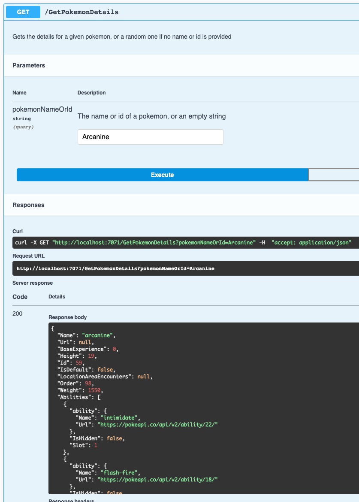
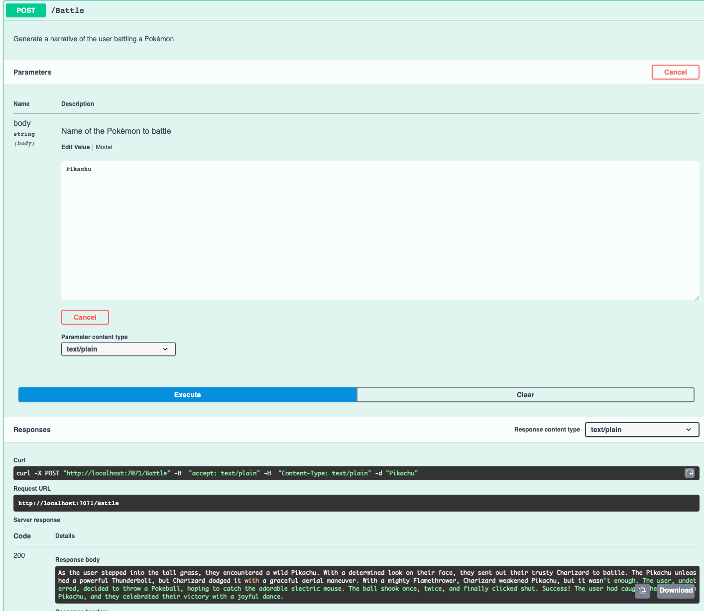
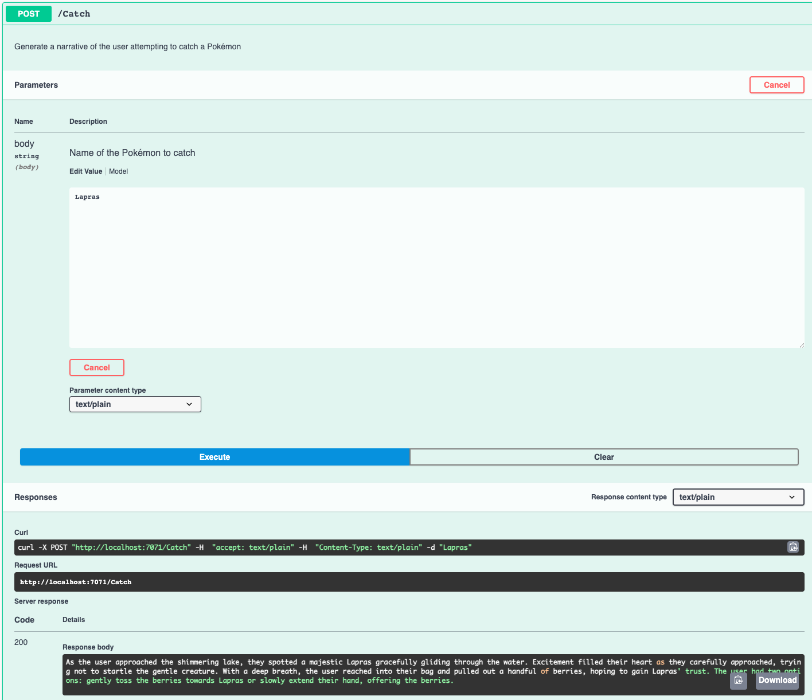
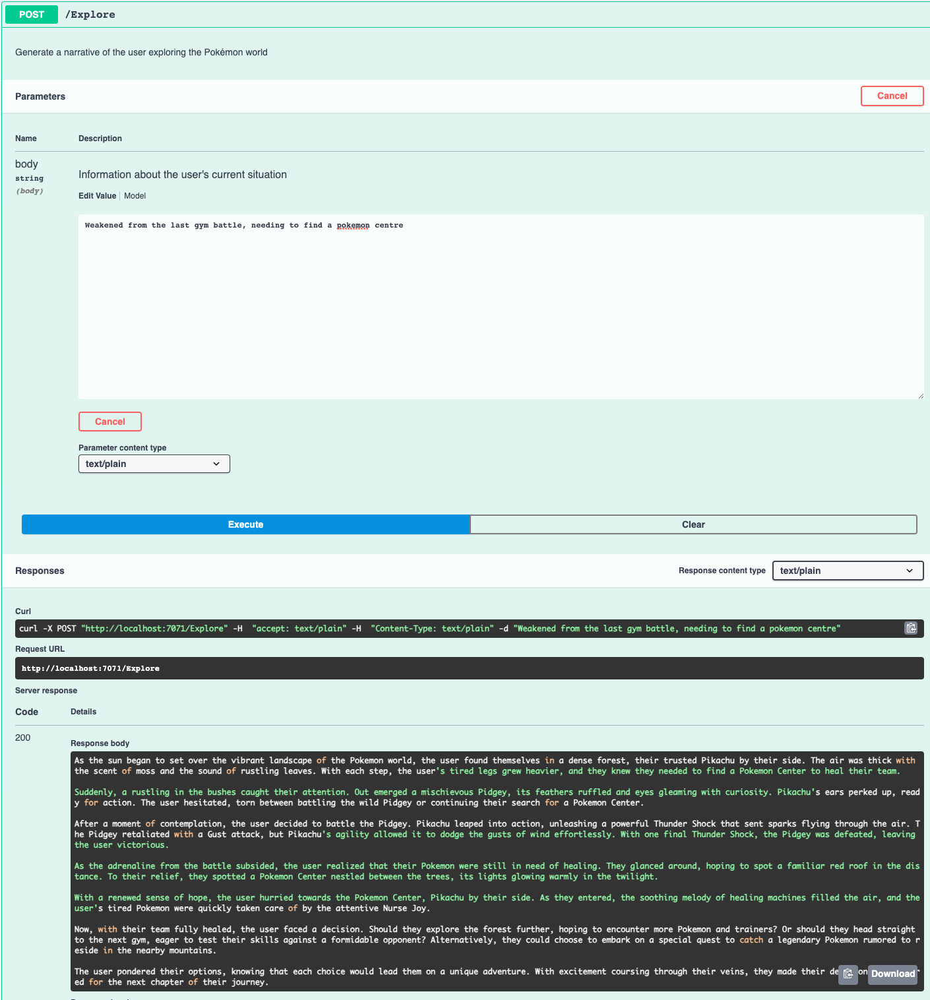

# Interactive Pokémon Adventure ChatGPT Plugin

The Interactive Pokémon Adventure Plugin is a tool that adds a Pokémon choose your own adventure game into ChatGPT. It uses OpenAI's GPT-3 to generate narratives and responses, and it communicates with the Pokémon API to fetch data about Pokémon for the game.

It was set up for the Semantic Kernel Plugins Hackathon #1.

This plugin has been tested locally but was unable to be tested using the ChatGPT UI due to the ChatGPT UI not being able to load the plugin without a paid subscription and access to the restricted add plugin functionality.

## Features

- Explore: Wander around the Pokémon world, encounter Pokémon and trainers, and make decisions about where to go next.
- Battle: Engage in Pokémon battles against wild Pokémon and other trainers.
- Catch: Attempt to catch the wild Pokémon you encounter.

## Usage

Once the plugin is installed, users can interact with it through the ChatGPT UI. They'll start an adventure, then make choices about what action to take next. The plugin will handle their choices and generate narratives and responses with GPT-3.

Here is a very brief example of how a user might interact with the plugin:

1. User: "Start an adventure."
2. Plugin: (Starts an adventure and fetches a random Pokémon) "You find yourself in a vast meadow. In the distance, you spot a Pikachu. What do you do?"
3. User: "Battle the Pikachu."
4. Plugin: (Handles the 'Battle' action and generates a battle narrative) "You send out your Charmander. It uses Ember, dealing a decent amount of damage. Pikachu counters with a quick attack. The battle is on! What's your next move?"
5. User: "Use a Poké Ball."
6. Plugin: (Handles the 'Catch' action and generates a catching narrative) "You throw a Poké Ball at the Pikachu. It wiggles once... twice... three times... click! You've successfully caught the Pikachu!"

## Screenshots

### Retrieve Pokemon details from the API

### Battle a Pokemon, using details from the API

### Try to catch a Pokemon, using details from the API

### Explore the world of Pokemon, using details from the API

## Disclaimer

This project is a fan-made creation and is not affiliated with the official Pokémon franchise or the Pokémon Company. Pokémon is a trademark of Nintendo, Creatures Inc., and GAME FREAK Inc.
